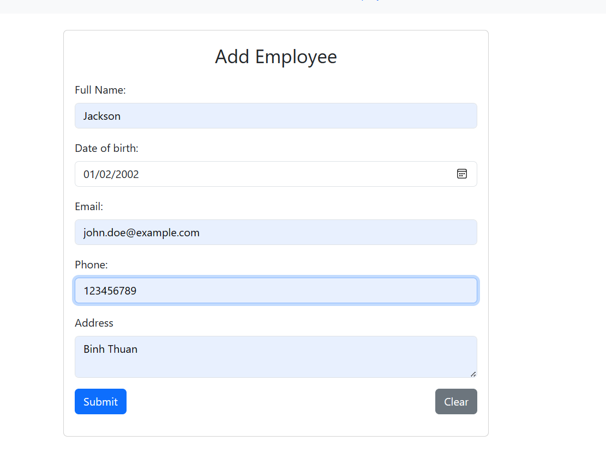
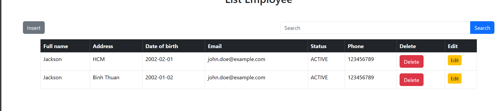
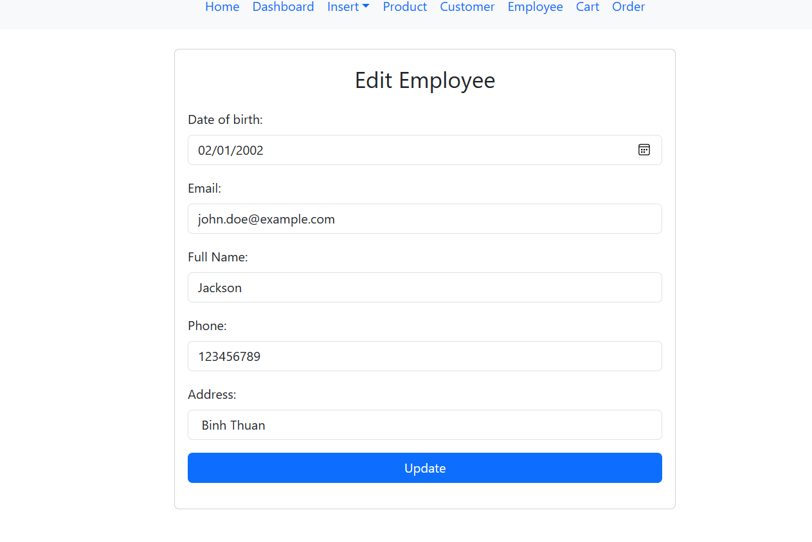
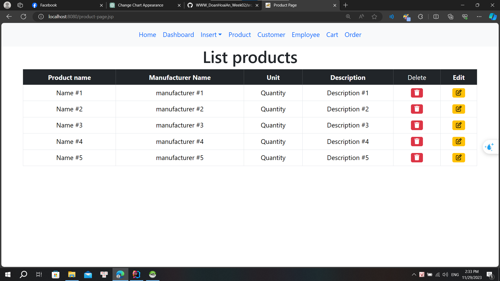
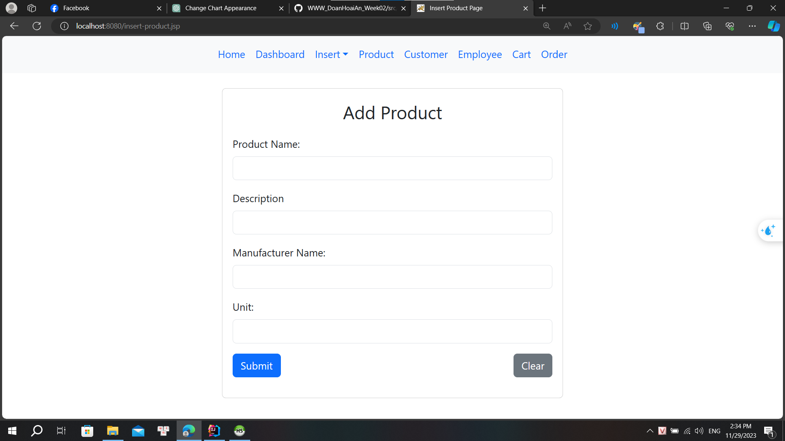
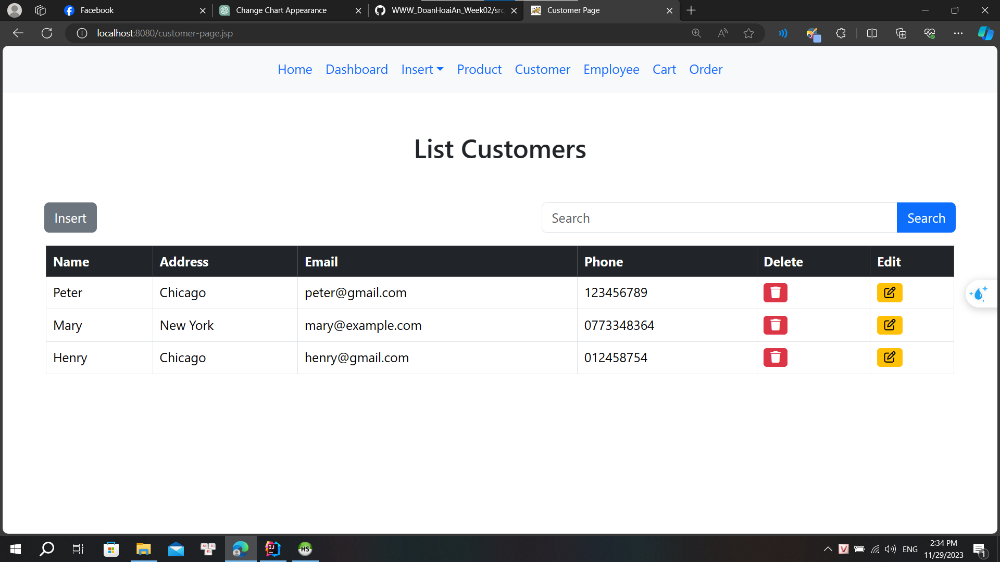
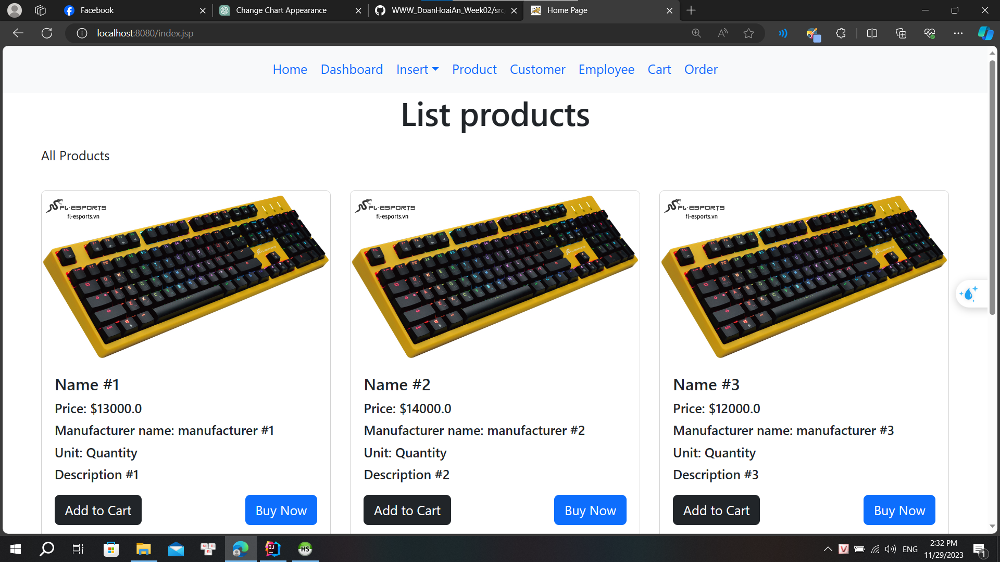
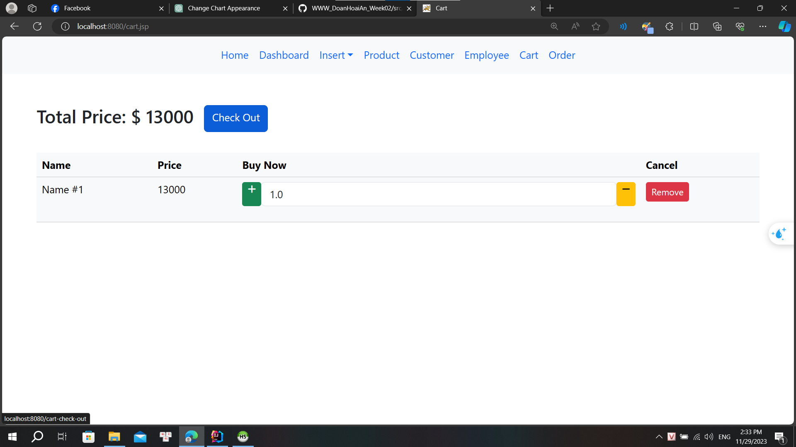

# WWW_DoanHoaiAn_Week02
Các thao tác CRUD cho các đối tượng, lập order. (dùng JPA).

Add

hiển thị list employee

update

Product

add

Customer

- Thống kê order theo ngày, theo khoảng thời gian.
- Thống kê order theo nhân viên bán hàng trong 1 khoảng thời gian.
  Web:
- Tạo các trang web cho việc hiển thị sản phẩm, chọn vào giỏ hàng và thanh toán (giả lập việc thanh toán qua thẻ nếu có thể)
- 

- Vẽ biểu đồ giá theo thời gian

[//]: # (- ![img_5.png]&#40;img_5.png&#41;)